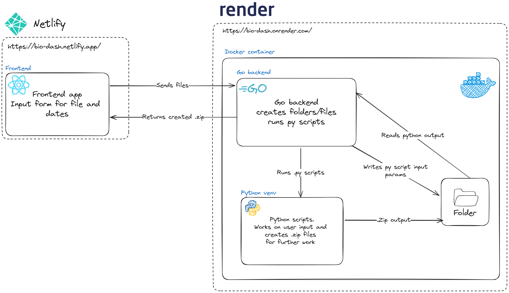

# Bio service

A small web service written in go, and react to parse data from the DAMS-x senzor.
The senzor data file is passed to a go backend that runs a python script and returns a zip file for further analysis.

## Development environment setup

Using:

- Go `v1.21.0`
- Node `v20.5.0`
- Docker `v24.0.5`
- Python `3.10.12`

### Run backend

Activate the python virtual environment

```shell
.../backend:$ . ./py/venv/bin/activate
```

Install py requirements `./backend/py/requirements.txt`

```shell
.../backend:$ pip install -r ./py/requirements.txt
```

Run go backend:

```shell
.../backend:$ go run ./cmd/main.go
```

Respectively you can use the Dockerfile to build a local image and start a container.

> NOTE: you will run into CORS issues. To avoid those issues localy, a line of code should be changed inside the server.go file. (...yes yes i know, i should add a config file to address this and also address logging, debug, etc...)

```go
    ...
	c.Writer.Header().Set("Access-Control-Allow-Origin", "*")
    ...
```

### Run frontend

npm install inside `bio-dash` dir

```shell
.../bio-dash:$ npm install
```

spin-up local dev server

```shell
.../bio-dash:$ npm run dev
```

### High level arch overview

High lever architecture diagram.



> Is this overengineerd? definitely...

### TODO

- [ ] unit tests
